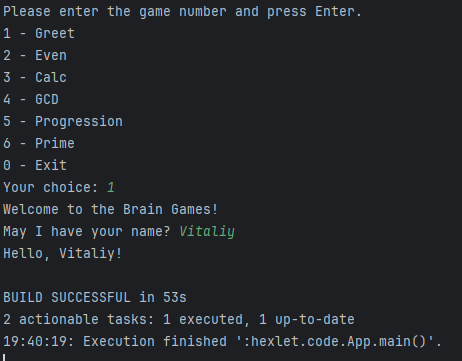
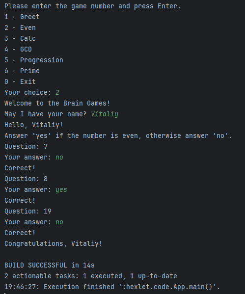
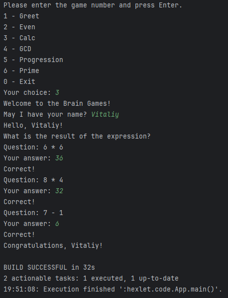
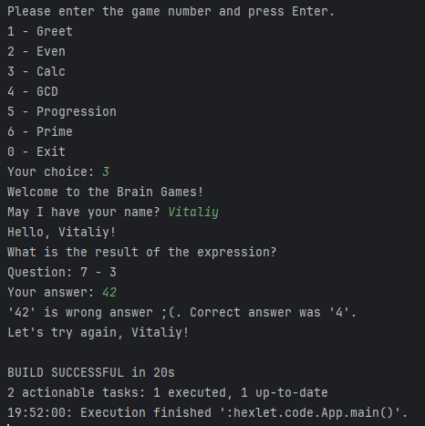
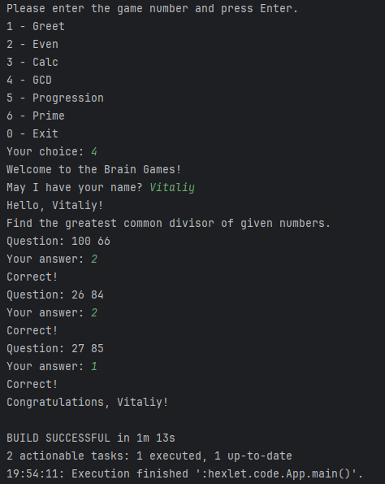
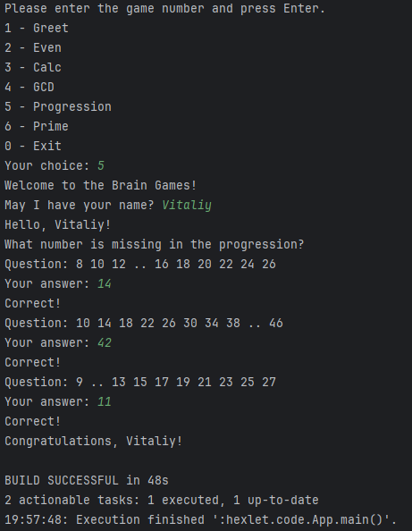
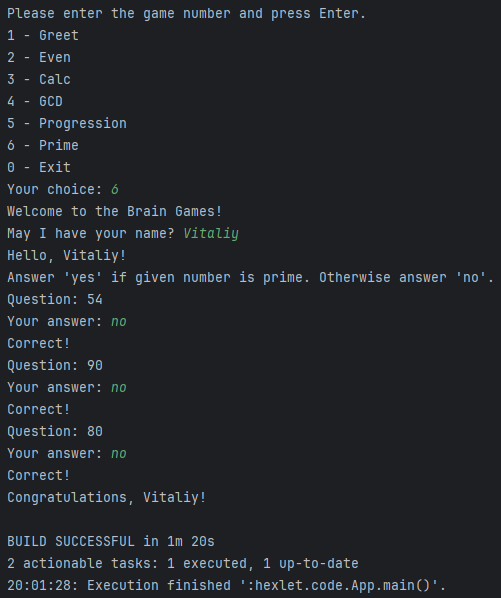
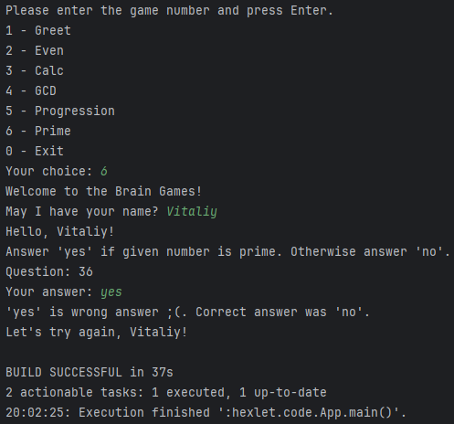
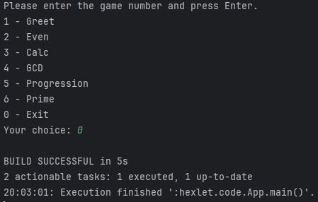

# Java Project 61

Brain Games

1. **Greet** - Приветствие и знакомство
2. **Even** - Проверка числа на чётность
3. **Calc** - Арифметические выражения
4. **GCD** - Наибольший общий делитель
5. **Progression** - Арифметическая прогрессия
6. **Prime** - Простые числа
7. **Exit** - Выход

**Greet** - Приветствие и знакомство

**Even** - Проверка числа на чётность

Позитивный сценарий

 

Негативный сценарий

**Calc** - Арифметические выражения

Позитивный сценарий

Негативный сценарий

**GCD** - Наибольший общий делитель

Позитивный сценарий

Негативный сценарий

**Progression** - Арифметическая прогрессия

Позитивный сценарий

Негативный сценарий

**Prime** - Простые числа

Позитивный сценарий

Негативный сценарий

**Exit** - Выход

